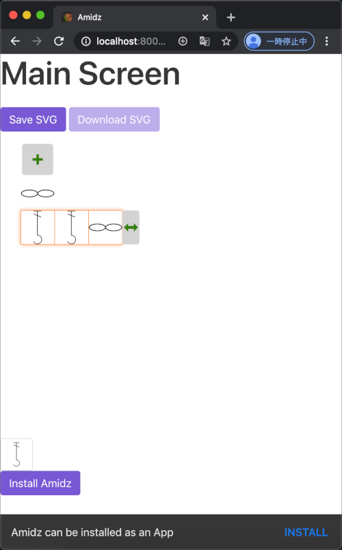

[English](README.md)/日本語

[](https://circleci.com/gh/kikuomax/amidz)
[](https://percy.io/Kikuo-Emoto/amidz)

# Amidz

編み図エディター。

</img>

## プロトタイプアプリケーション

このリポジトリのGitHub Pageでは、[プロトタイプアプリケーション](https://kikuomax.github.io/amidz/)を提供しています。
このプロトタイプアプリケーションはProgressive Web App (PWA)です。

### 利用シナリオ

利用シナリオは[こちら](scenarios_ja.md)。

### プロトタイプアプリケーションをローカルでテストする

プロトタイプアプリケーションはローカルでテストできます。
[`/docs/pwa`](/docs/pwa)フォルダにはプロトタプアプリケーションを提供するサーバを`localhost:8000`で走らせるJavaScriptが含まれています。

サーバを起動するには以下のステップを実施してください。

1. [`docs/pwa`](/docs/pwa)に移動します。

    ```
    cd docs/pwa
    ```

2. 必要なモジュールをイントールします(初回のみ)。

    ```
    npm install
    ```

3. サービスを起動します。

    ```
    npm start
    ```

4. サーバは http://localhost:8000/ で要求を待ちます。
   以下のようなスクリーンを表示します。

   

### プロトタイプアプリケーションをデプロイする

[`docs/pwa/www`](/docs/pwa/www)ディレクトリには最新のプロトタイプアプリケーションのファイルが含まれています。
それらのファイルは[`src`](/src)ディレクトリにあるソースファイルから[Webpack](https://webpack.js.org)を使ってビルドすることができます。
もし新しいアプリケーションをソースファイルからビルドしてデプロイしたい場合は、以下のステップを実施してください。

1. このリポジトリのルートディレクトリにいるものと仮定します。

2. 必要なモジュールをインストールします(初回のみ)。

    ```
    npm install
    ```

3. アプリケーションをビルドします。

    ```
    npm run build
    ```

4. アプリケーションのファイルが`dist`ディレクトリに作られます.

5. [`docs/pwa/www`](/docs/pwa/www)ディレクトリの中身を`dist`ディレクトリの中身で置き換えます.

    ```
    rm -rf docs/pwa/www
    cp -r dist docs/pwa/www
    ```

これであなたのアプリケーションをセクション「[プロトタイプアプリケーションをローカルでテストする](#プロトタイプアプリケーションをローカルでテストする)」に記載した手順で動かすことができます.

### プロトタイプアプリケーションをデバッグする

アプリケーションをデプロイする前にデバッグしたいはずです。
アプリケーションをビルドするたびに結果を[`docs/pwa/www`](/docs/pwa/www)ディレクトリにコピーするのはいちいち面倒なので、アプリケーションのデバッグを行なっている間は[Wabpack Dev Server](https://webpack.js.org/configuration/dev-server/)を使うことができます。
Webpack Dev Serverを開始するには、以下の手順を実施してください。

1. このリポジトリのルートディレクトリにいるものと仮定します。

2. 必要なモジュールをインストールします(初回のみ)。

    ```
    npm install
    ```

3. Webpack Dev Serverを開始します。

    ```
    npm run dev
    ```

4. デフォルトのブラウザが http://localhost:8080 を開くはずです。

Webpack Dev Serverはソースファイルへの変更を監視して自動的にアプリケーションをリビルドするので、ソースファイルを編集した際に手動でアプリケーションをリロードする必要はありません。

### ユニットテスト

Amidzのyニットテストは以下のツールに支えられています。
- [Mochapack](https://github.com/sysgears/mochapack): テストランナー
- [Chai](https://www.chaijs.com): アサーションライブラリ
- [Sinon](https://sinonjs.org): スパイ
- [Vue Test Utils](https://vue-test-utils.vuejs.org): Vueコンポーネントのテスト

ユニットテストを実行するためには、以下のステップを実施してください。

1. このリポジトリのルートディレクトリにいるものと仮定します。

2. 必要なモジュールをインストールします(初回のみ)。

    ```
    npm install
    ```

3. ユニットテストを実行します。

    ```
    npm test
    ```

4. テスト結果がコンソール上に出力されるはずです。

ステップ3で`-- --watch`を指定するとテストを[ウォッチモード](https://github.com/sysgears/mochapack#watch-mode---watch)で実行できます。

```
npm test -- --watch
```

### End-to-Endテスト

End-to-End(E2E)テストは[Cypress](https://www.cypress.io)で行います。
E2Eテストを実行するためには、以下のステップを実施してください。

1. このリポジトリのルートディレクトリにいるものと仮定します。

2. 必要なモジュールをインストールします(初回のみ)。

    ```
    npm install
    ```

3. Webpackの開発サーバを **バックグラウンド** で開始します。

    ```
    npm run dev &
    ```

4. Cypressを実行します。

    ```
    npm run cypress:run
    ```

5. テスト結果がコンソール上に出力されるはずです。

ステップ3で`cypress:run`の代わりに`cypress:open`を指定するとテストを[インタラクティブモード](https://docs.cypress.io/guides/guides/command-line.html#cypress-open)でCypressを実行することができます。

```
npm run cypress:open
```

### コードのドキュメンテーションの生成

Amidzのソースコードは[JSDoc](https://github.com/jsdoc/jsdoc) + [jsdoc-vuejs](https://github.com/Kocal/jsdoc-vuejs)プラグインでドキュメントしています。
コードのドキュメンテーションを生成したい場合は、以下のステップを実施してください。

1. このリポジトリのルートディレクトリにいるものと仮定します。

2. 必要なモジュールをインストールします(初回のみ)。

    ```
    npm install
    ```

3. JSDocを実行します。

    ```
    npm run build:doc
    ```

4. ドキュメンテーションは`api-doc`ディレクトリに生成されます。